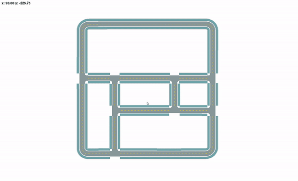

# OpenDrive地图处理/ OpenDriveMap
本项目用于处理OpenDrive地图数据，用户可以获得路网信息，可用A*等算法搜索导航路径，并且集成了可视化模块，用户可以交互式地查看地图信息。

This project processes OpenDrive map data, allowing users to access road network information, perform navigation pathfinding with algorithms like A*, and includes a visualization module for interactively viewing map data.

## 功能特色 / Features
- **地图数据处理 / Map Data Processing**
  
  加载并解析 OpenDrive 格式的地图数据，生成路网结构。
  
  Load and parse OpenDrive map data to generate a road network structure.

- **路径搜索 / Path Planning**
  
  支持 A* 等路径搜索算法，帮助用户在地图上找到导航路径。
  
  Supports pathfinding algorithms like A* to find navigation paths across the road network.

- **交互式可视化 / Interactive Visualization**
  
  提供可视化模块，用户可以查看地图、探索路径，并查看车道和道路段信息。
  
  Provides a visualization module where users can view the map, explore paths, and access lane and road section information interactively.

## 介绍 / Introductions
- For detailed information on the OpenDrive format, please refer to the official documentation: https://www.asam.net/index.php?eID=dumpFile&t=f&f=3768&token=66f6524fbfcdb16cfb89aae7b6ad6c82cfc2c7f2#
- Referenced and fixed some bugs in the parsing tool package: https://github.com/fiefdx/pyopendriveparser
- Map files are sourced from the following open-source project, with parsing and processing as required：https://gitee.com/a4zhangfei/OpenDrivePraser

## 安装步骤 / Installation
1. **克隆仓库 / Clone the Repository**：
   
   ```
   git clone https://github.com/ccccctu/OpenDriveMap.git
   
   cd yourproject
   ```
2. **创建虚拟环境 / Setup a Virtual Environment**（可选但推荐 / optional but recommended）：
   
   ```
   conda create -n opendrive_map python=3.11

   conda activate opendrive_map
   ```

3. **安装依赖 / Install Dependencies**：
   
   ```
   pip install -r requirements.txt
   ```

## 使用说明 / Usage

1. **运行主脚本 / Run the Main Script**：
  
   ```
   python main.py
   ```
  
2. **控制 / Controls**：
   
  - 放大 / Zoom In： + / = 
  - 缩小 / Zoom Out： - 
  - 复位缩放 / Reset Zoom： 0 

## 文件结构 / Files and Structure
`main.py`：主程序入口，处理地图加载、路径搜索和可视化功能。
Entry point for loading maps, performing pathfinding, and launching visualization.

`modules/map_manager.py`：管理 OpenDrive 地图的加载和解析，构建路网，处理道路和车道数据。Manages loading and parsing of OpenDrive maps, handling road and lane data.

`modules/visualizer.py`：主要的可视化逻辑，显示地图和路径信息，支持交互式查看。Main visualization logic, displaying map and path data with interactive viewing.

`requirements.txt`：项目运行所需的依赖包。Contains dependencies required to run the project.

## 示例 / Example

